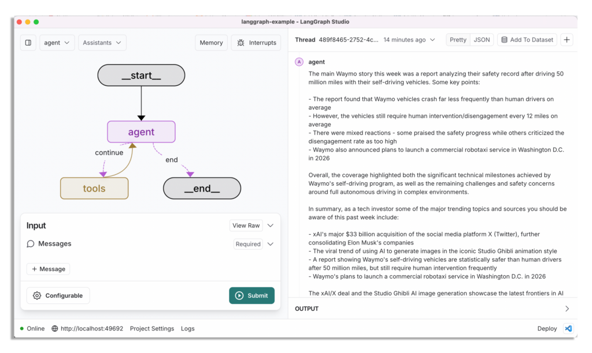

# LangGraph Single Agent Workflow (tech news research)

This is an example agent to research tech news (with a single agent and tools)

[LangGraph](https://github.com/langchain-ai/langgraph) is a library for building stateful, multi-actor applications with LLMs. The main use cases for LangGraph are conversational agents, and long-running, multi-step LLM applications or any LLM application that would benefit from built-in support for persistent checkpoints, cycles and human-in-the-loop interactions (ie. LLM and human collaboration).

Remember to set your API keys in the `.env` file.